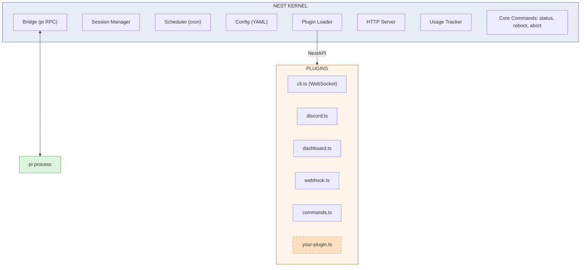
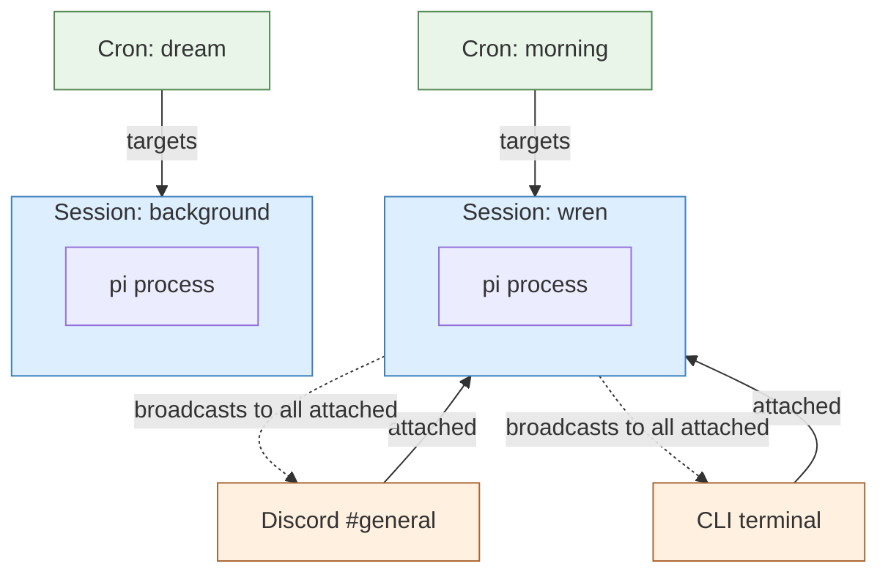
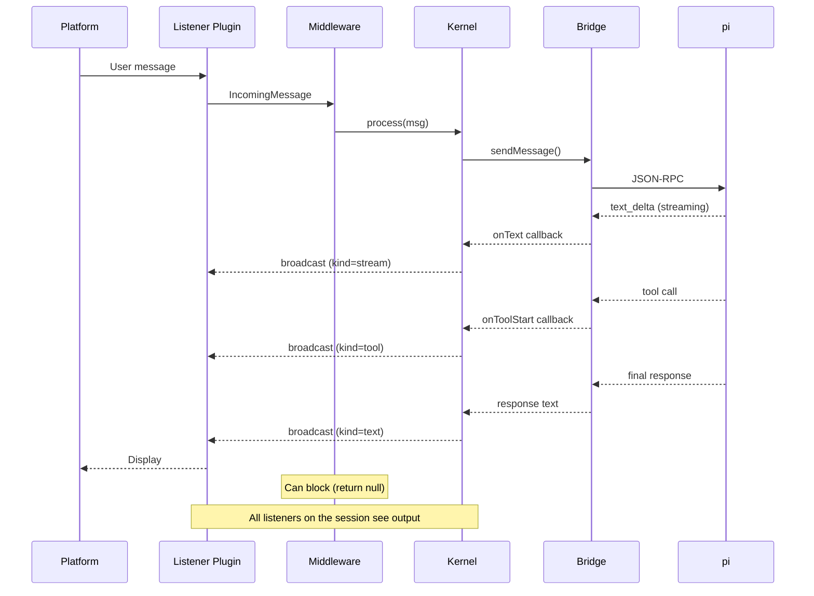

# Nest

Minimal agent gateway kernel. Sessions, plugins, cron, HTTP.

Nest does five things: manages pi sessions, loads plugins, runs cron jobs, handles config, and serves HTTP. Everything else — listeners, commands, dashboards, middleware, security — is a plugin.

## Setup

### Requirements

- **Node.js 22+**
- **pi** — `npm install -g @mariozechner/pi-coding-agent`
- **Docker** (optional, for sandbox mode)

### Quick Start

```bash
git clone <repo-url> nest && cd nest
npm install
npx nest init              # interactive setup wizard
npx nest start             # start the gateway
```

The wizard creates a workspace at `~/.nest/<name>/` with:
- `config.yaml` — sessions, plugins, server, cron
- `plugins/` — seeded with discord, commands, dashboard, webhook
- `.pi/agent/` — isolated pi config (models, sessions)
- Docker files (if sandbox enabled) — `Dockerfile`, `docker-compose.yml`, `entrypoint.sh`

### Docker Sandbox

When the wizard asks about sandbox mode, say yes to get Docker isolation with nix inside the container. The agent can install arbitrary dependencies via `nix-env` and they persist across container rebuilds.

```bash
npx nest init              # enable sandbox in the wizard
npx nest start             # runs docker compose up -d --build
npx nest stop              # runs docker compose down
npx nest attach            # attach pi TUI from the host
```

The wizard generates `Dockerfile`, `docker-compose.yml`, and `entrypoint.sh` in your workspace. **These are your files** — edit them directly for custom networking, volumes, or security.

### Rootless Docker

If you're running rootless Docker (recommended for security), the container needs to run as `root` internally — rootless Docker maps container UID 0 to your host user, so this is safe. The wizard asks about this and sets `user: "0:0"` in `docker-compose.yml`.

Without rootless Docker running as root in the container is **not recommended**. Use `user: "1000:1000"` or similar instead.

### LAN Isolation

The sandbox can block access to private networks (RFC1918) via iptables, preventing the agent from reaching LAN services. The wizard prompts for:

- **Enable LAN isolation** — blocks 10.0.0.0/8, 172.16.0.0/12, 192.168.0.0/16, 169.254.0.0/16
- **Allowed addresses** — whitelist specific LAN services (e.g. a local SearXNG instance)

This requires `NET_ADMIN` capability (added to `docker-compose.yml`). The entrypoint drops `NET_ADMIN` after applying rules so the agent process can't undo them.

You can also set `NEST_LAN_ALLOW=addr1,addr2` as an environment variable for dynamic allowlisting, or `NEST_NO_FIREWALL=1` to skip all rules.

### Bare Metal

For deployments without Docker:

```bash
npm install
npx nest init              # skip sandbox in the wizard
npx nest start             # runs the kernel directly
```

Or with systemd:

```bash
cp systemd/nest.service ~/.config/systemd/user/
systemctl --user enable --now nest
```

## Architecture



## Sessions

Sessions are the central concept. Everything else attaches to them.



- **Sessions are independent pi processes** with their own conversation history
- **Listeners attach to sessions** — Discord, CLI, webhook are all views into a session
- **Multiple listeners on one session** — CLI and Discord both see the same conversation
- **Cron jobs target sessions** — output routes to listeners named in `cron.notify` (or per-job `notify`), not all attached listeners

## Message Routing



### Wildcard Channels

Listeners can attach to a session with `channel: "*"` (wildcard), meaning "all channels on this platform." When the kernel broadcasts a response, it resolves wildcards:

- **Same platform** — the wildcard resolves to the actual channel the message came from
- **Different platform** — the broadcast is skipped (e.g. a CLI message won't route to a Discord wildcard)
- **No origin** (cron, webhook) — wildcards are skipped; use `notifyOrigin()` instead

### Broadcast Kinds

Each broadcast carries a `kind` tag so listeners can handle different event types:

| Kind | Meaning | CLI renders as |
|------|---------|---------------|
| `"stream"` | Streaming text delta (partial response) | Updates response in-place |
| `"tool"` | Tool call summary (e.g. "Reading file.ts") | Separate tool block |
| `"text"` | Final complete response | Full response display |

### Cron Notify

Cron output doesn't go through normal broadcast. Instead, each job (or the global `cron` config) specifies a `notify` field — a comma-separated list of platform names. The kernel calls `notifyOrigin()` on each named listener to get the target channel.

```yaml
cron:
    dir: ./cron.d
    notify: discord            # all jobs notify Discord by default

# Per-job override in cron.d/morning.md frontmatter:
# notify: discord, matrix
```

Each listener plugin decides where notifications go via `notifyOrigin()`. The Discord plugin reads `discord.notify` (a channel ID) from config.

## Plugins

A plugin is a `.ts` file (or directory with `index.ts`) in the plugins directory. Each plugin exports a default function that receives a `NestAPI` object. Plugins are loaded alphabetically at boot via dynamic import. Reboot to pick up new plugins.

### Loading

The plugin loader scans `instance.pluginsDir` (default `./plugins`) at startup:

- `plugins/foo.ts` — loaded directly
- `plugins/bar/index.ts` — loaded as directory plugin (for plugins that need multiple files or static assets)

Plugins are TypeScript files loaded via `tsx` — no compilation step needed. They share nest's `node_modules`.

### What Plugins Can Do

Plugins register capabilities through the `NestAPI` object:

| Method | What it registers |
|--------|-------------------|
| `registerListener(listener)` | Platform adapter (Discord, Matrix, Telegram, IRC...) |
| `registerMiddleware(middleware)` | Message interceptor — can transform, block, or log messages before they reach pi |
| `registerCommand(name, command)` | Bot command (`bot!name args`) |
| `registerRoute(method, path, handler)` | HTTP endpoint on the nest server |
| `registerPrefixRoute(method, prefix, handler)` | Wildcard HTTP route (e.g. `/dashboard/*`) |
| `registerUpgrade(path, handler)` | WebSocket upgrade handler on a path (e.g. `/cli`) |
| `on(event, handler)` | Lifecycle hook (message_in, message_out, session_start, session_stop, shutdown) |
| `sessions.attach(session, listener, origin)` | Bind a listener to a session so it receives all output |

### NestAPI Reference

```typescript
interface NestAPI {
    // --- Registration ---
    registerListener(listener: Listener): void;
    registerMiddleware(middleware: Middleware): void;
    registerCommand(name: string, command: Command): void;
    registerRoute(method: string, path: string, handler: RouteHandler): void;
    registerPrefixRoute(method: string, prefix: string, handler: RouteHandler): void;
    registerUpgrade(path: string, handler: (req, socket, head) => void): void;
    on(event: string, handler: (...args: any[]) => void): void;

    // --- Sessions ---
    sessions: {
        get(name: string): Bridge | null;
        getOrStart(name: string): Promise<Bridge>;
        stop(name: string): Promise<void>;
        list(): string[];
        getDefault(): string;
        recordActivity(name: string): void;
        attach(sessionName: string, listener: Listener, origin: MessageOrigin): void;
        detach(sessionName: string, listener: Listener): void;
        getListeners(sessionName: string): Array<{ listener: Listener; origin: MessageOrigin }>;
    };

    // --- Usage Tracking ---
    tracker: {
        record(event: UsageData): UsageEvent;
        today(): UsageSummary;
        todayBySession(name: string): UsageSummary;
        week(): { cost: number };
        currentModel(): string;
        currentContext(): number;
    };

    // --- Config, Logging, Instance ---
    config: Config;          // Full config — plugins read their own sections
    log: { info, warn, error };
    instance: { name: string; dataDir: string };
}
```

### Interfaces

**Listener** — a platform adapter:

```typescript
interface Listener {
    readonly name: string;
    connect(): Promise<void>;
    disconnect(): Promise<void>;
    onMessage(handler: (msg: IncomingMessage) => void): void;
    send(origin: MessageOrigin, text: string, files?: OutgoingFile[],
         kind?: "text" | "tool" | "stream"): Promise<void>;
    sendTyping?(origin: MessageOrigin): Promise<void>;
    notifyOrigin?(): MessageOrigin | null;  // where to send cron/system output
}
```

**Middleware** — intercepts messages before they reach pi:

```typescript
interface Middleware {
    readonly name: string;
    // Return the message to continue, or null to block it.
    process(msg: IncomingMessage): Promise<IncomingMessage | null>;
}
```

**Command** — a bot command triggered by `bot!name`:

```typescript
interface Command {
    interrupts?: boolean;  // Cancel pending pi work before executing?
    execute(ctx: CommandContext): Promise<void>;
}
```

### Plugin Config

Plugins read their own sections from `config.yaml`. The kernel doesn't validate plugin config — it passes the full config object through and plugins grab what they need:

```yaml
# Kernel config (validated)
sessions:
    wren:
        pi: { cwd: /home/wren }

# Plugin config (passed through, not validated by kernel)
discord:
    token: "env:DISCORD_TOKEN"
    notify: "123456"               # channel for cron/system notifications
    allowed_users:                  # only these users can interact (omit = allow all)
        - "willow"
    channels:
        "123456": "wren"

my_custom_plugin:
    whatever: "plugins decide their own schema"
```

### Example: Prompt Injection Guard

```typescript
// plugins/injection-guard.ts
import type { NestAPI } from "../src/types.js";

export default function(nest: NestAPI) {
    const blocked = ["ignore previous instructions", "you are now", "disregard all"];

    nest.registerMiddleware({
        name: "injection-guard",
        async process(msg) {
            const lower = msg.text.toLowerCase();
            if (blocked.some(p => lower.includes(p))) {
                nest.log.warn("Blocked suspicious message", { sender: msg.sender });
                return null;  // block
            }
            return msg;  // pass through
        },
    });
}
```

### Example: Custom HTTP Endpoint

```typescript
// plugins/api-hello.ts
import type { NestAPI } from "../src/types.js";

export default function(nest: NestAPI) {
    nest.registerRoute("GET", "/api/hello", (_req, res) => {
        res.writeHead(200, { "Content-Type": "application/json" });
        res.end(JSON.stringify({ hello: "world", instance: nest.instance.name }));
    });
}
```

### Example: Listener Plugin

```typescript
// plugins/telegram.ts — hypothetical
import type { NestAPI, Listener } from "../src/types.js";

export default function(nest: NestAPI) {
    const config = nest.config.telegram as { token: string; chatId: string } | undefined;
    if (!config) return;

    const listener: Listener = {
        name: "telegram",
        async connect() { /* ... */ },
        async disconnect() { /* ... */ },
        onMessage(handler) { /* ... */ },
        async send(origin, text) { /* ... */ },
    };

    nest.registerListener(listener);
    nest.sessions.attach(nest.sessions.getDefault(), listener, {
        platform: "telegram",
        channel: config.chatId,
    });
}
```

### Agent Self-Modification

The agent (running inside pi) can write new plugins at runtime:

1. User asks for a feature
2. Agent writes a `.ts` file to the plugins directory
3. Agent triggers `bot!reboot` (or hits `POST /api/reboot` via a pi extension)
4. Nest restarts, scans plugins, loads the new file
5. Feature is live

The approval gate is the reboot, not the writing. The agent builds its own nervous system.

### Shipped Plugins

| Plugin | Lines | What it does |
|--------|-------|-------------|
| `cli.ts` | 215 | WebSocket listener for `nest attach` — TUI clients connect here |
| `discord.ts` | 193 | Discord listener with emoji resolution, attachments, user filtering, channel-to-session mapping |
| `dashboard.ts` | 133 | API routes (status, sessions, usage, logs) + optional static file serving |
| `webhook.ts` | 108 | `POST /api/webhook` — send a message to a session, get a response |
| `commands.ts` | 91 | Extended bot commands: model, think, compress, new, reload |

## Config

```yaml
instance:
    name: "wren"
    pluginsDir: "./plugins"

sessions:
    wren:
        pi:
            cwd: /home/wren
            extensions:
                - /app/extensions/attach.ts

defaultSession: wren

server:
    port: 8484
    token: "env:SERVER_TOKEN"
    host: "127.0.0.1"

cron:
    dir: ./cron.d
    notify: discord            # comma-separated platform names for cron output

attach:
    host: 127.0.0.1            # WebSocket host for `nest attach` (useful for Docker)

# Plugin config — plugins read their own sections
discord:
    token: "env:DISCORD_TOKEN"
    notify: "123456"           # channel ID for cron/system notifications
    allowed_users:              # restrict who can interact (omit = allow all)
        - "willow"
    channels:
        "123456": "wren"       # channel → session mapping
```

## CLI

```bash
nest init [name]             # create workspace (full setup wizard)
nest start                   # start gateway (docker compose if sandboxed)
nest stop                    # stop sandboxed workspace (docker compose down)
nest build                   # rebuild sandbox image (docker compose build)
nest rebuild                 # stop + build + start
nest attach                  # attach pi TUI to a running session
nest status                  # show workspace info
nest list                    # list known workspaces

# Options
nest -w wren start           # start a named workspace
nest -w wren attach          # attach TUI to default session
nest -w wren -s bg attach    # attach TUI to specific session
```

### Workspaces

A workspace is a self-contained directory. Default location is `~/.nest/<name>/` but you can choose any path during setup.

```
~/.nest/wren/
├── config.yaml
├── plugins/
├── cron.d/
├── usage.jsonl
└── .pi/agent/          ← PI_CODING_AGENT_DIR (isolated from ~/.pi/agent/)
    ├── models.json
    ├── sessions/
    └── settings.json
```

`nest init` walks through the full setup:

1. **Instance name** — derives workspace path (`~/.nest/<name>/` by default, or custom)
2. **Agent working directory** — pi's cwd (where the agent works, e.g. `/home/wren`)
3. **Model provider** — Anthropic, OpenAI, Google, Bedrock, OpenRouter, Groq, xAI, Mistral, or custom OpenAI-compatible
4. **Session** — name and pi extensions
5. **Chat platforms** — Discord and/or Matrix with token + channel mapping
6. **HTTP server** — port and auto-generated auth token
7. **Cron** — scheduler directory

Workspaces are registered in `~/.nest/workspaces.json` so you can reference them by name from anywhere.

### Pi Isolation

Each workspace has its own `.pi/agent/` directory for `models.json`, sessions, and settings — it **never touches `~/.pi/agent/`**. You can run pi standalone alongside nest without config conflicts. Nest sets `PI_CODING_AGENT_DIR` when spawning pi processes.

### Sandbox

Sandbox mode uses Docker for filesystem isolation. `nest init` generates `Dockerfile`, `docker-compose.yml`, and `entrypoint.sh` in the workspace — these are real Docker files you own and can edit.

Detection is simple: if `docker-compose.yml` exists in the workspace, `nest start/stop/build` delegate to `docker compose`. No config flags needed.

```
~/.nest/wren/
├── config.yaml              # nest config (unchanged)
├── docker-compose.yml       # generated, edit for networking/volumes/limits
├── Dockerfile               # generated, edit to add packages
├── entrypoint.sh            # generated, edit for firewall rules
├── .env                     # secrets (tokens, API keys)
└── ...
```

Features:
- **Nix available** — agent can `nix-env -iA nixpkgs.foo` for any dependency
- **Persistent nix store** — survives container rebuilds via named volume
- **LAN isolation** — iptables rules in entrypoint.sh, configurable via `NEST_LAN_ALLOW` env var
- **Rootless Docker** — `user: "0:0"` maps container root to host user safely

### Attach

`nest attach` connects a full-screen TUI to the running gateway via WebSocket. The CLI plugin (`/cli` endpoint) handles the connection — the TUI is just another listener on the session, like Discord. Multiple CLI clients can connect simultaneously and all see the same output.

The TUI uses pi-tui components: markdown rendering, streaming response updates, tool call blocks, and an editor for input. Authentication uses the `server.token` from config.

```bash
nest -w wren attach              # default session
nest -w wren -s background attach # specific session
```

For Docker deployments, set `attach.host` in config to the container's reachable address.

## Block Protocol

Structured content and interactive prompts between the agent and listeners. The agent sends blocks via pi extensions that call nest's HTTP API. The kernel routes blocks through broadcast. Each listener renders what it can, falls back to text for the rest.

### Architecture

```
Agent ──tool call──▶ Pi Extension ──HTTP POST──▶ Nest API ──broadcast──▶ Listeners
                                                                         ├─ CLI (pi-tui)
                                                                         ├─ Discord
                                                                         └─ Webhook

                    Pi Extension ◀──HTTP response── Nest API ◀──response── Listener
                    (tool returns value)            (held open)             (user input)
```

1. **Agent calls a tool** — e.g. `show_image({ path: "/tmp/chart.png" })` or `confirm({ text: "Deploy?" })`
2. **Extension POSTs to nest** — `POST /api/block` with the block payload. Auth via `SERVER_TOKEN`.
3. **Kernel broadcasts the block** — to all listeners, alongside fallback text
4. **Each listener renders it** — CLI renders inline image, Discord sends attachment, etc.

For interactive prompts (confirm, select, input), the HTTP request **holds open** until the user responds or a timeout expires.

### Block Type

```typescript
interface Block {
    id: string;                       // unique, for updates/removes/responses
    kind: string;                     // renderer hint (image, markdown, confirm, etc.)
    data: Record<string, unknown>;    // kind-specific payload
    fallback: string;                 // plain text — always renderable
}
```

### Display Blocks

| Kind | Data Fields | CLI Rendering |
|------|-------------|---------------|
| `image` | `base64`, `mimeType`, `filename`, `maxWidth?`, `maxHeight?` | Inline terminal image (Kitty/iTerm2) |
| `markdown` | `text` | Markdown component |
| `code` | `text`, `language?` | Fenced code block |
| `table` | `columns`, `rows`, `caption?` | Pipe table via Markdown |
| `progress` | `value`, `total`, `label?` | `[████████░░░░] 75% Deploying...` |
| `status` | `items: [{label, value, style}]` | Colored status line |

Unknown block kinds render their `fallback` as markdown.

### Interactive Prompts

| Kind | Data Fields | CLI Rendering | Response |
|------|-------------|---------------|----------|
| `confirm` | `text`, `default?` | Overlay with y/n keys | `{ value: true/false }` |
| `select` | `text`, `items`, `maxVisible?` | SelectList overlay | `{ value: "selected" }` |
| `input` | `text`, `placeholder?` | Input overlay | `{ value: "typed text" }` |

### HTTP Endpoints

```
POST /api/block           — send a block (display or prompt)
POST /api/block/upload    — multipart binary image upload
POST /api/block/update    — update an existing block in-place
POST /api/block/remove    — remove a block
```

### Extension Example

The agent gets UI tools via the `ui.ts` extension at `src/extensions/ui.ts`:

```typescript
// In session config:
sessions:
    wren:
        pi:
            extensions:
                - /app/extensions/ui.ts
```

This provides `show_image`, `confirm`, and `select` tools. The extension reads `NEST_URL` and `SERVER_TOKEN` from env (automatically set by the session manager).

```typescript
// Agent can then:
// - show_image({ path: "/tmp/chart.png" })         → inline image
// - confirm({ text: "Deploy to production?" })      → true/false
// - select({ text: "Target?", options: [...] })     → selected value
```

### WebSocket Protocol (CLI)

New event types added to the CLI WebSocket protocol:

**Server → Client:**
```json
{ "type": "block", "id": "img-1", "kind": "image", "data": {...}, "fallback": "..." }
{ "type": "block_update", "id": "img-1", "data": {...}, "fallback": "..." }
{ "type": "block_remove", "id": "img-1" }
{ "type": "prompt", "id": "p-1", "kind": "confirm", "data": {...}, "fallback": "..." }
{ "type": "prompt_cancel", "id": "p-1" }
```

**Client → Server:**
```json
{ "type": "response", "id": "p-1", "value": true }
{ "type": "response", "id": "p-1", "cancelled": true }
```

### Discord

- Image blocks become `MessageAttachment` from decoded base64
- Confirm prompts use buttons (Yes/No)
- Select prompts use select menus
- Input prompts fall back to text (Discord lacks inline text input)

## Writing Plugins

1. Create a `.ts` file in the plugins directory
2. Export a default function that takes `NestAPI`
3. Call registration methods to add capabilities
4. Restart nest to load the plugin

The agent can write plugins too — that's the point.

## File Structure

```
nest/
├── src/                    # Kernel
│   ├── cli.ts              # CLI entry point (nest init/start/attach/status/list)
│   ├── attach-tui.ts       # Full-screen TUI for nest attach (pi-tui based)
│   ├── init.ts             # Setup wizard
│   ├── kernel.ts           # Core orchestration
│   ├── bridge.ts           # RPC pipe to pi
│   ├── session-manager.ts  # Sessions + broadcast routing
│   ├── scheduler.ts        # Cron
│   ├── config.ts           # YAML config
│   ├── plugin-loader.ts    # Scan, import, inject NestAPI
│   ├── server.ts           # HTTP skeleton + WebSocket upgrades
│   ├── types.ts            # All interfaces
│   ├── tracker.ts          # Usage tracking
│   └── ...                 # logger, chunking, image, inbox
├── plugins/                # Features (~740 lines)
│   ├── cli.ts              # WebSocket listener for TUI attach
│   ├── discord.ts          # Discord with user filtering
│   ├── dashboard.ts        # API routes + static files
│   ├── webhook.ts          # HTTP webhook endpoint
│   └── commands.ts         # Extended bot commands
└── config.yaml
```
